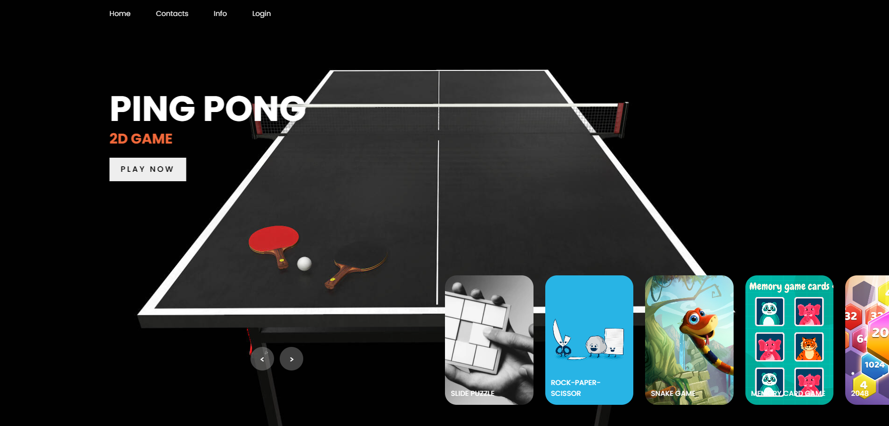

# Gaming Website

## Description
The Gaming Website is a platform designed to provide gamers with an engaging and interactive experience. It features a variety of games, leaderboards, user profiles, and more. This website aims to offer a seamless and enjoyable gaming experience for users of all skill levels.

## Screenshot
Here is a screenshot of the gaming website:




## Features
- **Game Library**: A collection of various games available for play.
- **User Profiles**: Create and manage user profiles with game statistics and achievements.
- **Leaderboards**: Track and display players score in various games.
- **Interactive Login and Sign-In Page**: Users can securely log in or sign up with an interactive and user-friendly interface.
- 
## Technologies Used
- **Frontend**:
  - HTML, CSS, JavaScript
- **Backend**:
  - Node.js, Express.js 
- **Database**:
  - MongoDB

## Installation
To set up the project locally, follow these steps:

1. **Clone the repository**:
   ```bash
   git clone https://github.com/your-username/gaming-website.git


